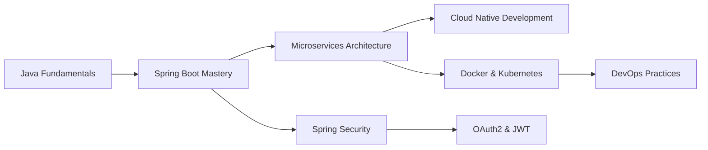

# 👨‍💻 Hello, I'm OMRG-01! 

<div align="center">
  
[](https://git.io/typing-svg)

</div>

---

## 🚀 About Me

```java
@Component
public class Developer {
    
    private String name = "OMRG-01";
    private String[] languages = {"Java", "SQL", "JavaScript"};
    private String[] frameworks = {"Spring Boot", "Spring Security", "Hibernate"};
    private String currentFocus = "Building scalable microservices";
    private boolean alwaysLearning = true;
    
    public String getCurrentGoal() {
        return "Mastering Spring Cloud & DevOps practices";
    }
    
    public String[] getInterests() {
        return new String[]{"Backend Architecture", "API Design", "Database Optimization"};
    }
}
```

- 🔭 **Currently Working On:** Enterprise-grade Spring Boot applications
- 🌱 **Learning:** Spring Cloud, Docker, Kubernetes, and Microservices Architecture
- 💡 **Passionate About:** Clean code, design patterns, and scalable systems
- 🤝 **Open to Collaborate On:** Open-source Java projects and Spring Boot applications
- 💬 **Ask Me About:** Java, Spring ecosystem, REST APIs, and database design
- 📫 **Reach Me:** [Your preferred contact method]
- ⚡ **Fun Fact:** I debug with coffee and solve problems with code! ☕

---

## 🛠️ Tech Stack & Tools

### 💻 Languages


### 🏗️ Frameworks & Libraries


### 🗄️ Databases


### 🔧 Tools & IDEs


---

## 📊 GitHub Stats

<div align="center">
  


</div>

---

## 🧠 Coding Challenges & Achievements

### 🏆 Codewars Progress
<div align="center">
  
[](https://www.codewars.com/users/omg3110)

**Current Rank & Stats:**
- 🎯 Solving algorithmic challenges daily
- 💪 Focused on Java problem-solving
- 📈 Continuously improving problem-solving skills

</div>

### 🏅 HackerRank Certifications & Badges

#### ⭐ Programming Badges


#### 📜 Verified Certifications
<div align="center">

| Certification | Level | Verification |
|---------------|-------|-------------|
| **Java (Basic)** | 🟢 Certified | [-2EC866?logo=hackerrank&logoColor=white)](https://www.hackerrank.com/certificates/aa543103ecb1) |
| **SQL (Basic)** | 🟢 Certified | [-2EC866?logo=hackerrank&logoColor=white)](https://www.hackerrank.com/certificates/519e480d88fc) |
| **SQL (Intermediate)** | 🟡 Certified | [-2EC866?logo=hackerrank&logoColor=white)](https://www.hackerrank.com/certificates/685f22e187c9) |
| **SQL (Advanced)** | 🔴 Certified | [-2EC866?logo=hackerrank&logoColor=white)](https://www.hackerrank.com/certificates/3f53c792eb0e) |

</div>

➡️ *Click on any badge to view the live certificate*

---

## 🌟 Featured Projects

<div align="center">

### 🎯 Coming Soon: My Best Spring Boot Projects!

*Currently organizing and documenting my projects. Stay tuned for:*
- 🏪 **E-Commerce API** - RESTful microservice with Spring Boot
- 🔐 **Authentication Service** - JWT-based security implementation  
- 📊 **Data Analytics Dashboard** - Spring Boot + React integration
- 🌐 **Blog Management System** - Full-stack web application

</div>

---

## 📈 Contribution Activity

<div align="center">
  


</div>

---

## 🎯 Current Learning Path



---

## 🤝 Let's Connect!

<div align="center">

[](your-linkedin-url)
[](your-twitter-url)
[](mailto:your-email)
[](your-portfolio-url)

### 💬 "Code is poetry written in logic"

</div>

---

<div align="center">

### 🌟 Thanks for visiting my profile! 


**Happy Coding!** 🚀

</div>

---

<!---
OMRG-01/OMRG-01 is a ✨ special ✨ repository because its `README.md` (this file) appears on your GitHub profile.
You can click the Preview link to take a look at your changes.
--->
